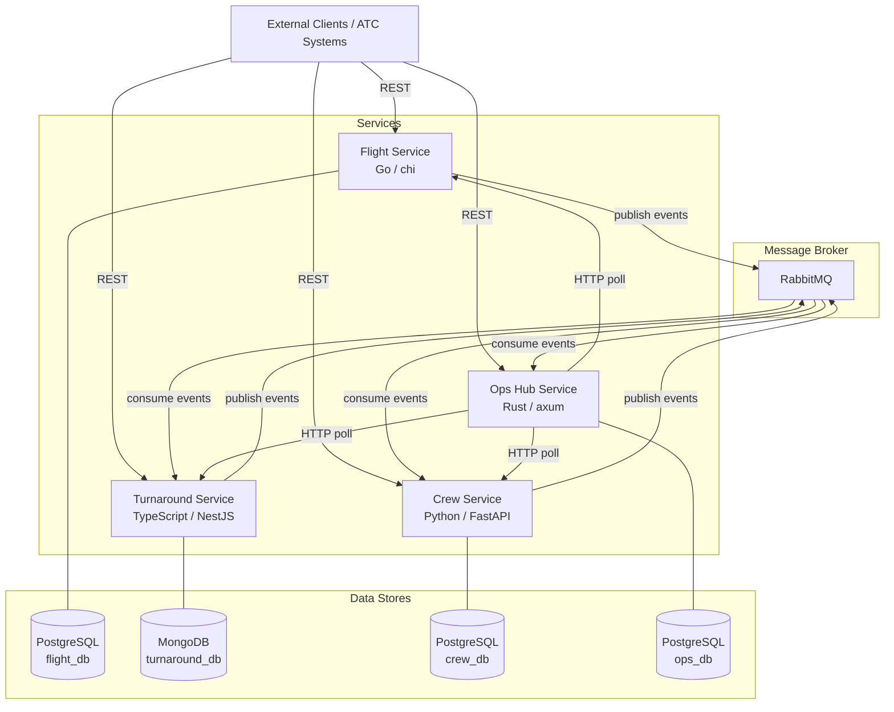
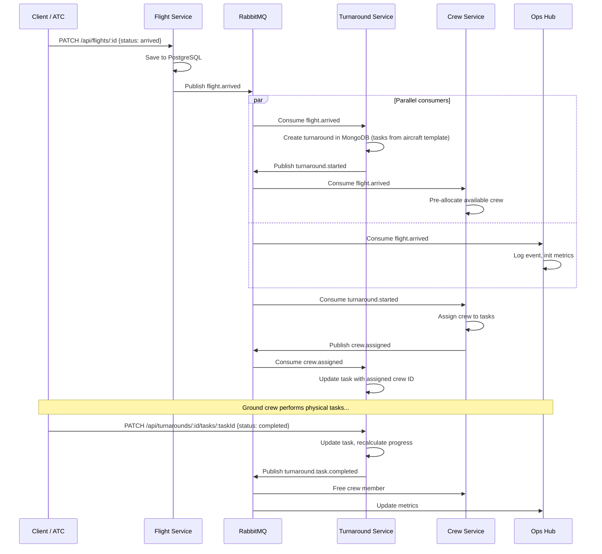
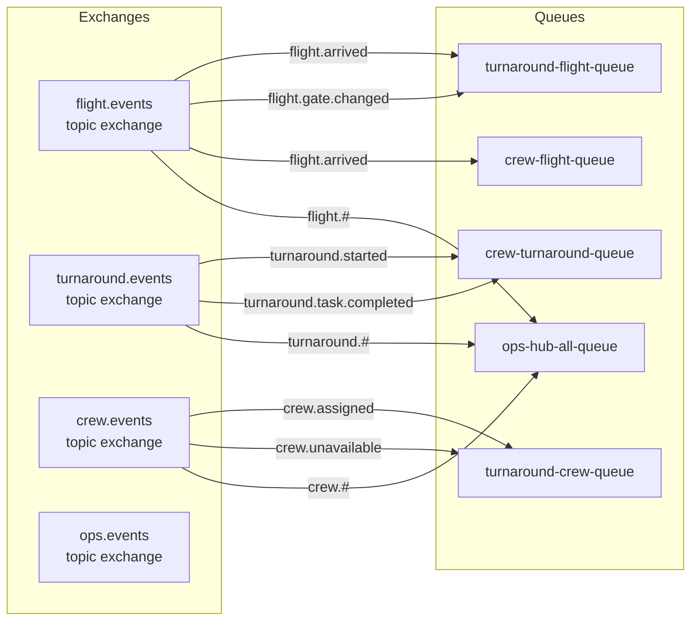

# High-Level Design — SkyTurn Airport Turnaround Operations

## System Overview

## Primary Event Flow: Flight Arrival → Turnaround

## RabbitMQ Exchange Design

## Scheduler Jobs (Ops Hub)

| Job | Interval | Description |
|---|---|---|
| Turnaround Delay Detector | 2 min | Check in-progress turnarounds: if progress < 50% at > 75% elapsed time → alert |
| Stuck Task Scanner | 3 min | Find tasks in_progress beyond expected duration → alert |
| Upcoming Arrival Pre-check | 5 min | Check flights arriving within 30 min vs available certified crew → alert |
| Certification Expiry Check | Daily 06:00 | Find certifications expiring within 7 days → publish event |

## Service Ports

| Service | Port | Health Endpoint |
|---|---|---|
| Flight Service | 8080 | GET /health |
| Turnaround Service | 3000 | GET /health |
| Crew Service | 8000 | GET /health |
| Ops Hub Service | 8001 | GET /health |
| RabbitMQ Management | 15672 | — |
| PostgreSQL | 5432 | — |
| MongoDB | 27017 | — |
